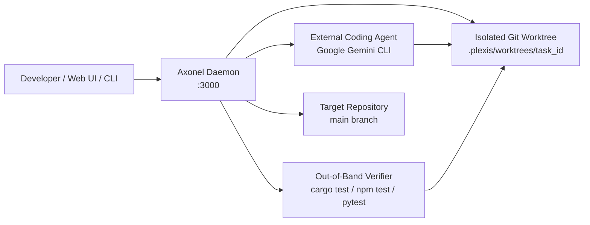

# Axonel

> Run coding agents autonomously without giving them control of your main branch.

<p align="center">
  
</p>

<p align="center">
  <a href="https://github.com/axonel/axonel/actions/workflows/ci.yml"></a>
  <a href="https://github.com/axonel/axonel/releases/tag/v0.1.1"></a>
  <a href="https://www.rust-lang.org"></a>
  <a href="#license"></a>
  <a href="#system-requirements"></a>
</p>

<p align="center">
  <a href="#quickstart">Quickstart</a> •
  <a href="#the-axonel-loop">The Axonel Loop</a> •
  <a href="#why-axonel">Why Axonel?</a> •
  <a href="#architecture">Architecture</a> •
  <a href="docs/getting-started.md">Getting Started</a> •
  <a href="docs/cli.md">CLI</a> •
  <a href="docs/api.md">API</a>
</p>

---

## What is Axonel?

Axonel is a local supervisor and control plane for coding agents. 

Instead of letting an agent edit your working directory directly, Axonel provisions an isolated Git worktree, supervises the agent process under strict resource budgets, independently verifies the code on disk using your ground-truth test suite, and halts at an explicit human review gate before anything touches your primary branch.

Axonel is not a chatbot or an interactive code-completion wrapper. It is the execution and governance layer that lets you delegate real engineering tasks to external coding agents (such as the Google Gemini CLI) with confidence.

---

## The Problem

Running a coding agent directly against a repository creates a heavy babysitting tax:

```text
Agent directly edits repo ──> Dirty working tree ──> Hallucinated "tests pass" ──> Bad commit ──> Developer cleans up the mess
```

- **Working Tree Hijacking**: In-place edits conflict with your active development, corrupt your branch state, or accidentally alter uncommitted files.
- **Hallucinated Passes**: Agents frequently claim tests pass when compilation failed silently or tests were never run.
- **Untracked Residue**: Agents leave untracked build artifacts or accidentally sweep databases and lockfiles into commits.
- **Zero Crash Durability**: Terminal disconnects or reboots lose all in-flight agent progress.

---

## The Axonel Loop

Axonel turns coding agents into supervised background workers:

```text
┌───────────┐     ┌───────────────────┐     ┌──────────────┐     ┌────────────────┐     ┌──────────────┐     ┌───────────────┐
│ Give Task │ ──> │ Isolated Worktree │ ──> │ Coding Agent │ ──> │ Verify on Disk │ ──> │ Human Review │ ──> │ Safe Merge    │
└───────────┘     └───────────────────┘     └──────────────┘     └────────────────┘     └──────────────┘     └───────────────┘
```

> **Axonel lets coding agents work autonomously without giving them direct control of your main working tree.**

---

## Why Axonel?

| Capability | Without Axonel | With Axonel |
| :--- | :--- | :--- |
| **Workspace Isolation** | Agent modifies your active files and branch in place. | Agent executes exclusively in an isolated Git worktree (`.plexis/worktrees/`). |
| **Test Verification** | Trusts the agent's self-reported success. | Supervisor independently runs `cargo test`, `npm test`, or `pytest` out-of-band on disk. |
| **Git Safety** | Agent can commit broken code directly to `main`. | `main` is untouched. Merges happen only after explicit human review and sign-off. |
| **Tree Hygiene** | Untracked files, databases, and lockfiles get swept into commits. | Automatic unstage rules enforce clean commits and reject dirty target trees. |
| **Crash Recovery** | Process death or reboot loses all mission progress. | SQLite WAL storage and Git ancestry checks restore in-flight missions durably. |
| **Process Control** | Runaway compilers or zombie children leak in the background. | POSIX process-group (PGID) termination kills all child processes on timeout. |

---

## Quickstart

### 1. Build and Start the Daemon

```bash
# Clone the repository
git clone https://github.com/axonel/axonel.git
cd axonel

# Build Web Dashboard assets and release binary
npm --prefix web ci && npm --prefix web run build
cargo build --release -p plexis-server --bin axonel

# Start the supervisor daemon (binds to 127.0.0.1:3000)
./target/release/axonel serve
```

Open **`http://127.0.0.1:3000`** in your browser to access the Web Operations Dashboard.

### 2. Dispatch a Mission via CLI

```bash
# Initialize a workspace for your project
axonel init /path/to/repo --name "my-project"

# Dispatch an autonomous mission
axonel mission create /path/to/repo \
  -o "Fix failing unit tests in parser.rs. Run cargo test and commit your fix." \
  -t "Fix parser tests"
```

The agent executes in an isolated worktree. When tests pass on disk, the mission halts at **`READY FOR REVIEW`**. Inspect the diff and accept:

```bash
# Inspect the unified diff
axonel mission diff <MISSION_ID>

# Accept and integrate into main
axonel mission accept <MISSION_ID> --integrate
```

> 📖 **Want a complete step-by-step tutorial with a disposable repository?**  
> Follow the **[Getting Started Guide](docs/getting-started.md)** for a full walkthrough using the Google Gemini CLI or the offline test agent.

---

## Architecture

Axonel is designed as an API-first local supervisor daemon backed by SQLite and POSIX process supervision:



- **Control Plane (`axonel serve`)**: Axum-based HTTP server providing REST APIs, live SSE event streaming, and the Web Operations Dashboard.
- **Execution Substrate**: Provisions isolated Git worktrees and spawns external CLI agents with POSIX process-group isolation (`setpgid`).
- **Independent Verifier**: Executes authoritative compilers and test suites directly against the worktree filesystem.
- **Transactional Git Engine**: Verifies Git ancestry (`git merge-base --is-ancestor`), enforces target branch cleanliness, and executes atomic rollbacks (`git merge --abort`) on merge conflicts.

---

## Supported Agents

| Backend | Provider / CLI Tool | Support Tier | Status | Notes |
| :--- | :--- | :--- | :--- | :--- |
| **`gemini_cli`** | Google Gemini CLI v0.60.0+ | **Tier 1 (Supported)** | **Production-Verified** | Official Google Gemini CLI adapter. Supports streaming JSON, tool calling, and isolated commits using `gemini-3.1-flash-lite`. Requires local credentials (`gemini auth login` or `GEMINI_API_KEY`). |
| **`fake_agent`** | Deterministic Local Mock | **Tier 1 (Test / CI)** | **Fully Verified** | Local test mock for offline demonstration, regression testing, and CI suites without API keys. |
| **`claude_code`** | Anthropic Claude Code | Tier 3 (Experimental) | Scaffold Stub | Interface stub registered in registry. Not supported for live missions in v0.1.1. |
| **`codex`** | OpenAI Codex / Aider | Tier 3 (Experimental) | Scaffold Stub | Interface stub registered in registry. Not supported for live missions in v0.1.1. |
| **`opencode`** | Local OpenCode Models | Tier 3 (Experimental) | Scaffold Stub | Interface stub registered in registry. Not supported for live missions in v0.1.1. |

---

## System Requirements

- **Operating System**: **Linux x86_64** (`x86_64-unknown-linux-gnu`). *Linux aarch64 is planned; macOS is experimental; Windows is unsupported.*
- **Rust Toolchain**: **Rust $\ge$ 1.88.0** (required for Rust 2024 edition).
- **Node.js & npm**: **Node.js $\ge$ 18.0**, **npm $\ge$ 9.0** (to build dashboard assets).
- **Git**: **Git $\ge$ 2.34** (requires `git worktree` support).
- **Google Gemini CLI**: Optional, required for live autonomous missions (`gemini --version` $\ge$ 0.60.0).

---

## Security

- **Safe Defaults**: Axonel binds strictly to `127.0.0.1:3000` (loopback) by default.
- **External Bind Rejection**: Binding to non-loopback interfaces requires an explicit `--auth-token` or `AXONEL_AUTH_TOKEN`; unauthenticated startup is rejected with exit code 1.
- **Process Group Isolation**: External agents execute in dedicated POSIX process groups. On timeout or cancellation, `killpg(pgid, SIGKILL)` terminates all child processes.
- **Secret Redaction**: In-memory regex filters scrub API keys, Bearer tokens, and private keys from streaming logs in real time.
- **Limitations**: Axonel provides process-group and worktree isolation, but does not provide a hardware sandbox (like gVisor or Firecracker) out of the box. External LLM backends transmit prompts and code snippets to provider APIs under your credentials.

*See [`docs/SECURITY_MODEL.md`](docs/SECURITY_MODEL.md) for the complete threat model.*

---

## Limitations

- **Linux x86_64 Certified**: Precompiled binaries and CI verification are certified strictly on Linux x86_64.
- **Gemini CLI Only**: Google Gemini CLI is the only external coding agent supported for live execution in v0.1.1.
- **Single-Repository Scope**: Each mission operates within a single Git repository. Multi-repo transactions are not supported.
- **Test Suite Determinism**: Axonel proves that *your tests passed on disk*. It does not mathematically prove correctness beyond what your test suite covers. Flaky tests can cause false-negative rejections.

*See [`docs/V1_LIMITATIONS.md`](docs/V1_LIMITATIONS.md) for the complete limitations disclosure.*

---

## Documentation Index

- 🚀 **[Getting Started Guide](docs/getting-started.md)** — Step-by-step walkthrough with a disposable repository.
- 📖 **[CLI Reference](docs/cli.md)** — Full command-line options for `axonel`.
- 🔌 **[REST API Reference](docs/api.md)** — Endpoints, payloads, and live SSE event streaming.
- 🛡️ **[Security Threat Model](docs/SECURITY_MODEL.md)** — Trust boundaries, process confinement, and secret redaction.
- ⚠️ **[Operational Limitations](docs/V1_LIMITATIONS.md)** — Transparent disclosure of supported platforms and boundaries.
- 📋 **[Claims Audit & Validation](docs/CLAIMS_AUDIT.md)** — Empirical verification receipts and truthfulness ledger.
- 📊 **[Real-World Validation Results](docs/REAL_WORLD_VALIDATION_RESULTS.md)** — Empirical evaluation across 20 benchmark tasks.
- 📝 **[Changelog](CHANGELOG.md)** — Release history and audit remediation notes.

---

## Contributing

```bash
# 1. Clone the repository
git clone https://github.com/axonel/axonel.git && cd axonel

# 2. Build frontend and run workspace tests
npm --prefix web ci && npm --prefix web run build
cargo test --workspace

# 3. Check linter and formatting
cargo fmt --all -- --check
cargo clippy --workspace --all-targets --all-features -- -D warnings
```

---

## License

Axonel is licensed under either of:

- Apache License, Version 2.0 (http://www.apache.org/licenses/LICENSE-2.0)
- MIT License (http://opensource.org/licenses/MIT)

at your option.
