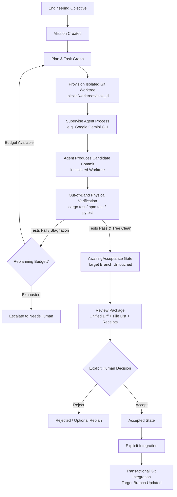
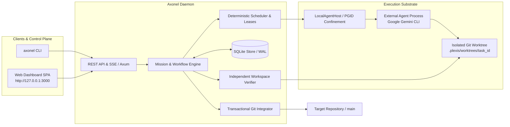

# Axonel

> A local control plane for coding agents.

[](https://github.com/axonel/axonel/actions/workflows/ci.yml)
[](https://github.com/axonel/axonel/releases/tag/v0.1.1)
[](https://www.rust-lang.org)
[](#license)
[](#system-requirements)
[](web/tests/e2e_release_candidate.mjs)

Axonel is a local supervisor and control plane for autonomous coding agents. Rather than acting as an interactive prompt wrapper or in-editor chatbot, Axonel supervises external coding agents (such as the Google Gemini CLI) inside isolated Git worktrees, enforces multi-dimensional resource budgets, independently verifies deliverables on disk using authoritative compilers and test suites, and halts at an explicit human acceptance gate before touching your target repository branch.

---

## Why Axonel?

Frontier coding models possess strong reasoning capabilities, but launching an agent directly against a developer's working directory introduces a heavy supervisory burden:

- **Working Tree Hijacking**: Direct agents edit files in place. If you switch branches, edit code, or have uncommitted work, your active working tree is corrupted, stashes conflict, or uncommitted files are accidentally altered.
- **Hallucinated Verification**: Agents frequently claim that tests passed when tests were never executed, assertions failed silently, or compilation warnings were ignored.
- **Untracked Residue & Swept Files**: Agents often leave behind untracked build artifacts, temporary scripts, or accidentally stage database files and lockfiles into commits.
- **Zero Crash Durability**: If your terminal disconnects, Wi-Fi drops, or the machine reboots, all in-flight agent state and context are lost.
- **Uncontrolled Main Commits**: Automated agents should not commit directly to primary branches without human oversight.

### The Supervisor Distinction

$$\begin{aligned}
\textbf{Coding Agent} &\implies \textbf{Worker} \quad (\text{generates code, calls tools, attempts repairs}) \\
\textbf{Axonel} &\implies \textbf{Supervisor} \quad (\text{provisions worktrees, bounds execution, verifies on disk, guards Git})
\end{aligned}$$

Axonel does not replace the coding agent. Instead, it provides the surrounding execution, governance, and reliability infrastructure that allows developers to delegate tasks to background agents safely.

---

## What Axonel Does

- **Provisions Isolated Git Worktrees**: Agent tasks execute strictly in dedicated worktrees (`.plexis/worktrees/<task_id>`), leaving your active working tree, index, and branch untouched.
- **Supervises External Processes**: Manages external agent CLIs under strict execution timeouts, turn limits, and POSIX process-group (PGID) signal confinement.
- **Independently Verifies on Disk**: Never trusts an LLM's self-reported success. Executes ground-truth toolchains (`cargo test`, `npm test`, `pytest`) out-of-band directly on the filesystem.
- **Enforces Working Tree Hygiene**: Standardizes Git staging with automatic unstage rules for SQLite databases (`*.db*`), lockfiles (`Cargo.lock`), build artifacts (`target/`), and sensitive credentials (`.env*`, `*.pem`).
- **Halts for Human Review (`AwaitingAcceptance`)**: Autonomous execution stops before integration. Generates unified review packages with diffs, changed files, and test receipts.
- **Guards Git Integration**: Enforces transactional Git integration (`POST /api/v1/missions/{id}/integrate`). Verifies Git ancestry, rejects dirty or stale target branches, and executes atomic rollback (`git merge --abort`) on merge conflicts.
- **Recovers State Across Crashes**: Authoritative SQLite storage (WAL mode) with deep startup reconciliation ensures in-flight missions and intermediate integration intents recover durably.
- **Redacts Secrets in Real Time**: In-memory streaming redactor scrubs Bearer tokens, OpenAI/Anthropic keys, Google API keys, and GitHub access tokens from terminal logs and event streams.

---

## Core Workflow



> [!IMPORTANT]
> **Core Safety Invariants:**
> 1. Agents operate exclusively inside isolated Git worktrees.
> 2. The target repository branch (`main`) is never modified before explicit human acceptance.
> 3. Integration is strictly blocked prior to acceptance; unaccepted integration requests return HTTP 409 Conflict.
> 4. Missions do not always succeed; unrecoverable errors or missing provider binaries fail fast and escalate to `NeedsHuman`.

---

## Architecture

Axonel is designed as a local daemon with an API-first control plane, backed by SQLite storage and POSIX process supervision:



### Architectural Subsystems

- **API & Control Plane (`plexis-server`)**: Axum-based HTTP server providing REST endpoints, Server-Sent Events (SSE) for live streaming, and static serving of the Web Operations Dashboard.
- **Workflow & Mission Engine (`plexis-runtime`)**: Implements durable state machines (`Created` $\to$ `Planning` $\to$ `Running` $\to$ `Verifying` $\to$ `AwaitingAcceptance` $\to$ `Accepted` $\to$ `Integrating` $\to$ `Integrated`).
- **Agent Host & Process Supervision (`plexis-runtime`)**: Spawns external CLI processes with POSIX process-group isolation (`setpgid`), monitors wall-clock timeouts, captures stdout/stderr ring buffers, and cascades `SIGTERM`/`SIGKILL` signals to child process trees.
- **Authoritative Storage (`plexis-storage`)**: SQLite database in WAL mode tracking missions, tasks, checkpoints, executions, leases, and an immutable audit event stream.
- **Independent Verifier (`plexis-runtime`)**: Physical filesystem inspector that runs compilers and test suites out-of-band and verifies that working trees are clean and required Git commits exist.
- **Transactional Git Engine (`plexis-server`)**: Manages worktree lifecycles, target branch freshness checks, merge conflict rollbacks, and crash reconciliation via Git ancestry (`git merge-base --is-ancestor`).

---

## Safety & Git Integration Model

Axonel's safety model protects your primary codebase from corruption:

### 1. Worktree Confinement
Agent processes are never granted direct write access to your primary working tree or target branch. Every mission provisions a dedicated worktree under `.plexis/worktrees/<task_id>`. All edits, builds, and candidate commits remain isolated within this path.

### 2. Physical Verification vs. Self-Reports
LLMs frequently hallucinate that their code changes work. Axonel rejects agent self-reports. Before a mission can advance to review, the supervisor executes your authoritative test command directly on disk, verifying:
- Exit code is `0` (all tests passed).
- Working tree is clean (`git status --porcelain` is empty).
- A new Git commit object exists in the worktree.

### 3. Explicit Human Acceptance Gate
When verification passes, the mission transitions to `AwaitingAcceptance` (`READY FOR REVIEW`). At this stage:
- The target branch remains completely untouched.
- An operator can inspect the comprehensive review package via `GET /api/v1/missions/{id}/review` or `axonel mission review <id>`.
- Any attempt to call `/integrate` before `/accept` is rejected with **HTTP 409 Conflict**.

### 4. Transactional Integration & Freshness Guard
During integration (`POST /api/v1/missions/{id}/integrate`):
- **Target Hygiene**: Rejects integration with HTTP 409 Conflict if the target repository has uncommitted changes or untracked files.
- **Freshness Check**: Verifies that the target branch HEAD matches `expected_target_head`.
- **Atomic Rollback**: If concurrent commits cause a merge conflict, Axonel automatically executes `git merge --abort`, leaves the target branch pristine, and resets the mission to `Accepted`.
- **Crash Durability**: An intermediate `Integrating` intent is logged in SQLite. If the daemon is abruptly terminated (`SIGKILL`), the startup reconciler queries Git ancestry (`git merge-base --is-ancestor`) to truthfully determine whether the merge landed.

### 5. Process Confinement & Secret Redaction
- External agent processes run in dedicated POSIX process groups. On cancellation or timeout, `killpg(pgid, SIGKILL)` terminates the agent along with any spawned compilers or child shells.
- In-memory regex filtering redacts API keys, Bearer tokens, and private keys from streaming logs before they reach SQLite or the Web UI.

---

## Quickstart

> [!WARNING]
> **Quickstart Safety**: Do not point Axonel at an important production repository on your first run. Start with a disposable test repository to observe the worktree isolation, physical verification, and human acceptance lifecycle firsthand.

### Path A: Real Google Gemini CLI Execution (`gemini_cli`)

This path uses the official Google Gemini CLI to execute real tool calls and code modifications in an isolated worktree.

#### 1. Prerequisites
- Google Gemini CLI installed: `gemini --version` (v0.60.0+)
- Active Gemini authentication: `gemini auth login` or `export GEMINI_API_KEY="..."`

#### 2. Create a Disposable Test Repository
```bash
mkdir -p /tmp/axonel-math-demo && cd /tmp/axonel-math-demo
git init -b main
git config user.name "Demo User" && git config user.email "demo@example.com"

# Create a minimal Rust project with an intentional bug in add()
cat << 'EOF' > Cargo.toml
[package]
name = "math_demo"
version = "0.1.0"
edition = "2021"
EOF

mkdir -p src
cat << 'EOF' > src/lib.rs
pub fn add(a: i32, b: i32) -> i32 {
    a - b // BUG: subtraction instead of addition
}

#[cfg(test)]
mod tests {
    use super::*;
    #[test]
    fn test_add() {
        assert_eq!(add(2, 3), 5);
    }
}
EOF

echo -e "/target\n" > .gitignore
git add -A && git commit -m "Initial commit with failing test"
```

Confirm that the test fails in your target repository:
```bash
cargo test # Fails with: assertion `left == right` failed (left: -1, right: 5)
```

#### 3. Start the Axonel Daemon
In a separate terminal:
```bash
axonel serve
# Binds safely to 127.0.0.1:3000 (loopback default)
```

#### 4. Register the Workspace
```bash
curl -s -X POST http://127.0.0.1:3000/api/v1/workspaces \
  -H "Content-Type: application/json" \
  -d '{"name": "math-demo", "canonical_path": "/tmp/axonel-math-demo"}'
```
*Note the returned `id` (e.g., `ws_01...`).*

#### 5. Dispatch the Mission
```bash
curl -s -X POST http://127.0.0.1:3000/api/v1/missions \
  -H "Content-Type: application/json" \
  -d '{
    "title": "Fix math addition bug",
    "objective": "Fix the subtraction bug in src/lib.rs so add(2, 3) equals 5. Run cargo test to verify, then commit your fix.",
    "workspace_id": "<YOUR_WORKSPACE_ID>",
    "backend": "gemini_cli",
    "stopping_condition": {
      "required_tests_pass": true,
      "working_tree_clean": true,
      "required_commit_exists": true
    },
    "auto_start": true
  }'
```
*Note the returned mission `id` (e.g., `msn_01...`).*

#### 6. Observe Execution & Review
1. Open the Web Dashboard at **`http://127.0.0.1:3000`**.
2. Watch the mission transition through `PLANNING` $\to$ `RUNNING` $\to$ `VERIFYING` $\to$ `READY FOR REVIEW` (`AwaitingAcceptance`).
3. Notice that `cargo test` in your primary repository (`/tmp/axonel-math-demo`) **still fails**—the agent modified only its isolated worktree.
4. Click **Review Package** to inspect the unified diff, changed files list (`src/lib.rs`), and independent verification receipts.

#### 7. Accept & Integrate
Click **Accept & Integrate** in the UI, or execute via CLI:
```bash
axonel mission accept <MISSION_ID> --integrate
```

Now verify your primary repository on disk:
```bash
cd /tmp/axonel-math-demo
git log -n 1 --oneline # Displays the integrated commit from Axonel Agent
cargo test             # test tests::test_add ... ok
```

---

### Path B: Offline / Deterministic Test Execution (`fake_agent`)

To test Axonel without external API keys or Gemini CLI installed, use the built-in deterministic test agent:

```bash
curl -s -X POST http://127.0.0.1:3000/api/v1/missions \
  -H "Content-Type: application/json" \
  -d '{
    "title": "Deterministic offline test",
    "objective": "Fix failing test",
    "workspace_id": "<YOUR_WORKSPACE_ID>",
    "backend": "fake_agent",
    "auto_start": true
  }'
```

The `fake_agent` mock runs locally, simulates multi-turn tool calling, edits the file in the isolated worktree, commits the fix, passes independent verification, and halts at `AwaitingAcceptance`.

---

## Installation & Requirements

### System Requirements

| Requirement | Supported Specification | Notes |
| :--- | :--- | :--- |
| **Operating System** | **Linux x86_64** (`x86_64-unknown-linux-gnu`) | Fully build-tested and verified in CI. Linux `aarch64` is planned; macOS is experimental; Windows is unsupported. |
| **Rust Toolchain** | **Rust $\ge$ 1.88.0** | Required for Rust 2024 edition compatibility (`rust-version = "1.88"`). |
| **Node.js & npm** | **Node.js $\ge$ 18.0**, **npm $\ge$ 9.0** | Required to build Web Dashboard static assets. |
| **Git** | **Git $\ge$ 2.34** | Required for robust `git worktree` isolation support. |
| **Google Gemini CLI** | **v0.60.0+** (Optional) | Required for live autonomous coding missions using `gemini_cli`. |

### Build from Source

```bash
# 1. Clone the repository
git clone https://github.com/axonel/axonel.git
cd axonel

# 2. Build Web Dashboard frontend assets
npm --prefix web ci
npm --prefix web run build

# 3. Compile the production release binary
cargo build --release -p plexis-server --bin axonel

# 4. Verify installation
./target/release/axonel --version
# Outputs: axonel 0.1.1
```

*(Optional)* Copy the binary to your system PATH:
```bash
sudo cp target/release/axonel /usr/local/bin/
```

---

## Supported Backends & Provider Matrix

| Backend Identifier | Provider / CLI Tool | Support Tier | Status in v0.1.1 | Description |
| :--- | :--- | :--- | :--- | :--- |
| **`gemini_cli`** | Google Gemini CLI v0.60.0+ | **Tier 1 (Supported)** | **Production-Verified** | Official Google Gemini CLI subprocess adapter. Supports streaming JSON, tool calling, and isolated worktree commits. Configured with model `gemini-3.1-flash-lite`. Requires local credentials (`gemini auth login` or `GEMINI_API_KEY`). |
| **`fake_agent`** | Deterministic Local Mock | **Tier 1 (Test / CI)** | **Fully Verified** | Internal test harness mock for deterministic regression testing, CI pipelines, and offline demonstrations. Built on demand if missing. |
| **`claude_code`** | Anthropic Claude Code CLI | **Tier 3 (Experimental Stub)** | Scaffold Stub | Interface stub registered in provider registry. Not supported for live autonomous coding missions in v0.1.1. |
| **`codex`** | OpenAI Codex / Aider | **Tier 3 (Experimental Stub)** | Scaffold Stub | Interface stub registered in provider registry. Not supported for live autonomous coding missions in v0.1.1. |
| **`opencode`** | Local OpenCode Models | **Tier 3 (Experimental Stub)** | Scaffold Stub | Interface stub registered in provider registry. Not supported for live autonomous coding missions in v0.1.1. |

> [!WARNING]
> Do NOT attempt to run production missions with `claude_code`, `codex`, or `opencode` in v0.1.1. `gemini_cli` is currently the **only** external agent backend certified for autonomous execution in this release.

---

## CLI Reference

The `axonel` command-line interface provides operational control over the daemon, workspaces, and missions:

```text
Usage: axonel [COMMAND]

Commands:
  serve      Start the Axonel operational control plane server
  init       Initialize a project workspace for Axonel
  status     Inspect system and workspace operational status
  mission    Manage autonomous engineering missions
  reconcile  Run deep startup and recovery reconciliation
  help       Print this message or the help of the given subcommand(s)
```

### Common Commands

```bash
# Start the supervisor daemon (binds to 127.0.0.1:3000 by default)
axonel serve

# Start on a custom port with bearer token authentication
axonel serve --port 8080 --auth-token "secret-token-value"

# Initialize a workspace in the current directory
axonel init . --name "my-service"

# Create and automatically dispatch a mission
axonel mission create /path/to/repo -o "Fix failing unit tests in parser" -t "Fix parser"

# Inspect the status of a mission
axonel mission status <MISSION_ID>

# Review the unified diff of a candidate deliverable
axonel mission diff <MISSION_ID>

# Inspect the full review package
axonel mission review <MISSION_ID>

# Accept a verified mission (and optionally integrate immediately)
axonel mission accept <MISSION_ID> --integrate

# Non-destructively reject a deliverable with an auditable reason
axonel mission reject <MISSION_ID> -r "Did not address edge cases in parser" --replan

# Safely integrate an already-accepted mission into main
axonel mission integrate <MISSION_ID>

# Run deep startup reconciliation manually
axonel reconcile
```

---

## REST API Reference

Axonel is API-first. The Web Dashboard and CLI communicate through standard JSON REST endpoints:

### System & Health
- `GET /health` or `GET /api/v1/health` — Basic liveness probe.
- `GET /api/v1/system/status` — Operational daemon status, uptime, and active leases.
- `GET /api/v1/auth/status` — Truthfully discloses whether authentication is enforced and whether the daemon is bound to loopback.

### Workspaces
- `POST /api/v1/workspaces` — Register a repository directory:
  ```json
  {
    "name": "my-repo",
    "canonical_path": "/absolute/path/to/my-repo"
  }
  ```
- `GET /api/v1/workspaces` — List registered workspaces.
- `GET /api/v1/workspaces/{id}/git/status` — Inspect Git status of a workspace.

### Missions
- `POST /api/v1/missions` — Create a new mission:
  ```json
  {
    "title": "Fix race condition in queue",
    "objective": "Resolve flaky test in queue_test.rs. Commit changes with git.",
    "workspace_id": "ws_01a0...",
    "backend": "gemini_cli",
    "stopping_condition": {
      "required_tests_pass": true,
      "working_tree_clean": true,
      "required_commit_exists": true
    },
    "auto_start": true
  }
  ```
- `GET /api/v1/missions/{id}` — Get detailed mission metadata, state, and outcome.
- `GET /api/v1/missions/{id}/review` — Retrieve the comprehensive review package (unified diff, changed files list, verification receipts, target HEAD freshness).
- `POST /api/v1/missions/{id}/accept` — Explicitly accept a verified deliverable (`{"integrate": true}` to accept and merge atomically).
- `POST /api/v1/missions/{id}/reject` — Reject a deliverable (`{"reason": "...", "continue_mission": true}`).
- `POST /api/v1/missions/{id}/integrate` — Integrate an accepted deliverable into the target branch (`{"target_branch": "main"}`).

### Streaming & Events
- `GET /api/v1/events/stream` — Live Server-Sent Events (SSE) stream of all mission transitions, agent executions, and verification events.
- `GET /api/v1/tasks/{id}/terminal` — Fetch bounded terminal output ring buffer with automated secret redaction.

---

## Observability

Axonel provides comprehensive visibility into background agent execution:

- **State Machine Transitions**: Every mission tracks explicit lifecycle states (`Created`, `Planning`, `Running`, `Replanning`, `Verifying`, `AwaitingAcceptance`, `Accepted`, `Integrating`, `Integrated`, `Rejected`, `NeedsHuman`, `BudgetExhausted`, `Cancelled`).
- **Process Telemetry**: Child process execution logs record exact process group IDs (PGID), command arguments, exit codes, and durations in SQLite.
- **Live SSE Event Stream**: The Web Dashboard and external monitors consume live Server-Sent Events from `/api/v1/events/stream`.
- **Secret-Redacted Terminal Buffers**: Subprocess stdout and stderr are captured in bounded in-memory ring buffers with sensitive API keys and tokens masked in real time.
- **Audit Event Log**: All operational actions, approvals, rejections, and Git integrations are recorded in an append-only SQLite event store.

---

## Project Validation & Release Evidence

Axonel v0.1.1 has undergone rigorous regression testing and empirical validation. All receipts below reflect actual project test executions:

| Verification Suite | Target / Command | Result | Status |
| :--- | :--- | :--- | :--- |
| **Rust Code Formatting** | `cargo fmt --all -- --check` | Clean (0 diffs) | **PASS** |
| **Rust Linter** | `cargo clippy --workspace --all-targets --all-features -- -D warnings` | Clean (0 warnings) | **PASS** |
| **Full Workspace Test Suite** | `cargo test --workspace` | 74 unit, integration, and doc tests passing across 9 crates | **PASS** |
| **Safety Invariant Regression** | `cargo test -p plexis-server --test quickstart_safety_regression_test` | Main branch untouched; zero untracked files swept | **PASS** |
| **Concurrency Stress Audit** | `cargo test --test concurrency_audit_tests` | 20 / 20 consecutive runs passed (0 flakes) | **PASS** |
| **Tool Execution & Sandboxing** | `cargo test -p plexis-tools --test tool_tests` | 5 / 5 passed (filesystem traversal prevention, redaction) | **PASS** |
| **Canonical Autonomous Run** | `cargo test -p plexis-runtime --test canonical_autonomous_run` | 1 / 1 passed (full end-to-end task execution) | **PASS** |
| **M19 Human Acceptance Suite** | `node web/tests/m19_acceptance_tests.mjs` | 15 / 15 scenarios passed (Scenarios A through O) | **PASS** |
| **M20 Integration & Reliability** | `node web/tests/m20_integration_reliability_tests.mjs` | 15 / 15 scenarios passed (including real Gemini Scenario O) | **PASS** |
| **Playwright Browser E2E** | `node web/tests/e2e_release_candidate.mjs` | 15 / 15 browser assertions passed in Chromium | **PASS** |
| **Clean-Install Smoke Test** | `node web/tests/clean_install_smoke_test.mjs` | 8 / 8 steps passed (`axonel 0.1.1` verified) | **PASS** |
| **Remote GitHub Actions CI** | Run `35461864340` & `35462170505` on `main` | All 12 CI jobs passed green | **PASS** |

*Note: These receipts represent project release validation performed by the project team with concrete evidence, not third-party certification.*

### Real Google Gemini CLI Execution Evidence

In both automated browser testing ([`e2e_release_candidate.mjs`](web/tests/e2e_release_candidate.mjs)) and integration testing ([`m20_integration_reliability_tests.mjs`](web/tests/m20_integration_reliability_tests.mjs), Scenario O), Axonel was validated using the real Google Gemini CLI (v0.60.0) with model `gemini-3.1-flash-lite`:

1. **Subprocess Execution**: Axonel spawned `/home/roonakyadav/.local/bin/gemini` as a supervised child process with dedicated PGID.
2. **Tool Calling**: The Gemini CLI executed 9 tool actions (`update_topic`, `read_file`, `cargo test`, `replace`, `cargo test`, `git add && git commit`).
3. **Worktree Commit**: Gemini committed code repairs inside the isolated worktree `agent/developer-...`.
4. **Physical Verification**: Out-of-band `cargo test` executed on disk in the worktree passed with exit code `0`.
5. **Acceptance Halt**: The mission halted at `AwaitingAcceptance`; target repository `main` HEAD remained untouched until explicit human acceptance.
6. **Integration**: Following `POST /api/v1/missions/{id}/accept` with `integrate=true`, the deliverable was cleanly fast-forward merged into `main`.

---

## Repository Structure

```text
axonel/
├── Cargo.toml                     # Workspace root manifest (MSRV: Rust 1.88+)
├── crates/
│   ├── plexis-core/               # Domain primitives: Mission, Task, State Machine, Events
│   ├── plexis-runtime/            # MissionEngine, AgentHost, WorktreeManager, Verifier
│   ├── plexis-server/             # Axum HTTP server, REST API, CLI (`axonel`), Git integrator
│   ├── plexis-storage/            # SQLite store (WAL mode), migrations, lease coordination
│   ├── plexis-tools/              # Built-in tools (Git, Filesystem, Shell), SecretRedactor
│   ├── plexis-planner/            # Task decomposition, DAG planning, prompt templates
│   ├── plexis-providers/          # Provider abstraction layer & backend registry
│   ├── plexis-memory/             # Context management & working memory stores
│   └── plexis-fake-agent/         # Deterministic test double binary for CI and tests
├── web/                           # Single-page Web Operations Dashboard (Vite / React)
├── docs/                          # Architecture, security model, and release specifications
└── migrations/                    # SQL schema migrations (0001-0005)
```

---

## Security & Threat Model

Axonel operates on local workstations and developer infrastructure. The security model prioritizes containment, repository integrity, and defense against unauthorized remote exposure:

- **Loopback Default**: Axonel binds strictly to `127.0.0.1:3000` by default.
- **Mandatory External Authentication**: Binding to non-loopback addresses (`0.0.0.0` or public network interfaces) strictly requires an authentication token via `--auth-token` or `AXONEL_AUTH_TOKEN`. Unauthenticated external startup is rejected with a fatal exit code.
- **Local-First Control Plane**: All SQLite mission records, worktrees, and audit events remain on local disk. Axonel does not upload source code or telemetry to any cloud service.
- **Process Group Isolation**: External agents execute in dedicated POSIX process groups (`setpgid`). When a task times out or is cancelled, `killpg(pgid, SIGKILL)` terminates the agent and any spawned child processes.
- **Automated Secret Redaction**: In-memory regex filtering redacts API keys, Bearer tokens, and private keys from streaming buffers and event logs.
- **Known Security Limitations**: Axonel provides process-group and Git worktree isolation, but it **does not provide a hardware-isolated sandbox (such as gVisor, Firecracker, or SELinux containers)** out of the box. Untrusted code execution should be contained within a dedicated virtual machine or container runner.
- **Cloud LLM Egress**: When using external providers (e.g. Gemini CLI), prompt text and repository snippets are transmitted to Google's API under your credentials.

*For complete details, see [`docs/SECURITY_MODEL.md`](docs/SECURITY_MODEL.md).*

---

## Operational Limitations & Boundaries

To set truthful expectations, Axonel's boundaries for v0.1.1 are explicitly documented:

- **Certified Platform**: **Linux x86_64** (`x86_64-unknown-linux-gnu`). Linux `aarch64` is planned; macOS is experimental; Windows is unsupported.
- **Supported External Agent**: **Google Gemini CLI (`gemini_cli`)** is the only certified external agent backend in v0.1.1. Claude Code, OpenAI Codex, and OpenCode adapters are scaffold stubs.
- **Single-Repository Scope**: Each mission operates within a single Git repository workspace. Multi-repository distributed transactions are not supported.
- **Single-Node Daemon**: Axonel runs as a single-machine supervisor daemon. It does not distribute work across Kubernetes or server clusters.
- **Git Worktree Dependency**: Target repositories must be valid Git repositories with `git worktree` support (`git >= 2.34`).
- **Test Suite Determinism**: Verification evaluates physical disk state against your configured test command (`cargo test`, `npm test`, `pytest`). Axonel proves that *your tests passed on disk*; it does not mathematically prove correctness beyond what your test suite verifies.
- **Merge Conflicts**: If the target branch moves concurrently and causes a merge conflict during integration, Axonel aborts the merge cleanly (`git merge --abort`) and returns HTTP 409 Conflict. It does not automatically resolve conflicting merge hunks.

*For the complete limitations disclosure, see [`docs/V1_LIMITATIONS.md`](docs/V1_LIMITATIONS.md).*

---

## Roadmap & Future Directions

The architectural roadmap focuses on expanding agent ecosystems and execution backends:

- **Additional External Agent Backends**: Implement live adapters for Anthropic Claude Code and OpenAI Codex.
- **Hardware Architecture Expansion**: Native compilation and CI verification for Linux `aarch64` (ARM64).
- **Containerized Isolation Backends**: Integrate rootless container backends (Bubblewrap / Docker) for hardened subprocess jailing.
- **Multi-Repository Workspaces**: Support coordinated missions spanning multiple interconnected Git repositories.

---

## Contributing

We welcome contributions to Axonel! To get started:

```bash
# 1. Clone the repository
git clone https://github.com/axonel/axonel.git
cd axonel

# 2. Build the frontend
npm --prefix web ci
npm --prefix web run build

# 3. Run the complete test suite
cargo test --workspace

# 4. Check formatting and clippy
cargo fmt --all -- --check
cargo clippy --workspace --all-targets --all-features -- -D warnings
```

Please review [`docs/SECURITY_MODEL.md`](docs/SECURITY_MODEL.md) and [`docs/PRODUCT.md`](docs/PRODUCT.md) before submitting major architectural changes.

---

## Documentation Index

- 🛡️ **[Security Threat Model (`docs/SECURITY_MODEL.md`)](docs/SECURITY_MODEL.md)**: Trust boundaries, process confinement, and secret redaction.
- ⚠️ **[Operational Limitations (`docs/V1_LIMITATIONS.md`)](docs/V1_LIMITATIONS.md)**: Transparent disclosure of supported platforms, backends, and constraints.
- 📋 **[Claims Audit & Truthfulness Ledger (`docs/CLAIMS_AUDIT.md`)](docs/CLAIMS_AUDIT.md)**: Classification of supported vs. retracted claims.
- 📊 **[Real-World Validation Results (`docs/REAL_WORLD_VALIDATION_RESULTS.md`)](docs/REAL_WORLD_VALIDATION_RESULTS.md)**: Empirical evaluation and failure taxonomy across 20 tasks.
- 📄 **[Product Requirements Document (`docs/PRODUCT.md`)](docs/PRODUCT.md)**: Product thesis, target user personas, and core loop.
- 📦 **[Reproducible Release Guide (`docs/REPRODUCIBLE_RELEASE.md`)](docs/REPRODUCIBLE_RELEASE.md)**: Deterministic build and packaging instructions.
- 📝 **[Changelog (`CHANGELOG.md`)](CHANGELOG.md)**: Complete release history and audit remediation notes.

---

## License

Axonel is licensed under either of:

- Apache License, Version 2.0 (http://www.apache.org/licenses/LICENSE-2.0)
- MIT License (http://opensource.org/licenses/MIT)

at your option.
