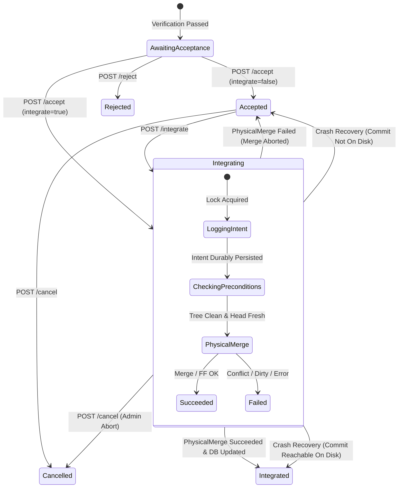

# Formal Specification: Axonel Integration State Machine & Consistency Guarantees

**Version:** 1.0.0-rc  
**Status:** Authoritative Specification  
**Scope:** Mission Integration, Concurrency Serialization, Crash Recovery & Repository Safety  

---

## 1. Domain Model & Formal Invariants

Axonel coordinates two independent storage engines:
1. **Relational Control Plane Storage (SQLite):** Stores mission metadata, task states, approval records, and immutable audit events.
2. **Physical Version Control Storage (Git):** Stores content-addressable objects, commits, trees, and branch references (`refs/heads/*`).

### The Consistency Axiom
$$\text{Transaction}_{\text{SQLite}} \neq \text{Transaction}_{\text{Git}}$$

Because SQLite and Git cannot participate in a native distributed Two-Phase Commit (2PC), Axonel implements an **intent-driven, Git-authoritative state machine**. 

The fundamental safety invariant is:
$$\text{State}(\text{mission}) = \text{Integrated} \implies \text{Commit}(\text{mission}) \in \text{Ancestry}(\text{TargetBranch})$$

Under no circumstance will Axonel report `integrated` if the candidate commit is not reachable from the target branch in the physical repository on disk.

---

## 2. The Integration State Machine

### Mathematical Formulation of States & Transitions

Let $S$ be the set of mission states:
$$S = \{ \text{Created}, \text{Planning}, \text{Running}, \text{Verifying}, \text{NeedsHuman}, \text{Replanning}, \text{AwaitingAcceptance}, \text{Accepted}, \mathbf{Integrating}, \mathbf{Integrated}, \text{Rejected}, \text{Cancelled}, \text{Failed}, \text{BudgetExhausted} \}$$

The integration subsystem governs transitions within the sub-automaton:
$$S_{\text{int}} = \{ \text{AwaitingAcceptance}, \text{Accepted}, \text{Integrating}, \text{Integrated}, \text{Cancelled} \}$$



### Transition Matrix

| Source State | Destination State | Trigger / Condition | Side Effects & Guarantees |
|---|---|---|---|
| `AwaitingAcceptance` | `Accepted` | `POST /accept` (`integrate: false`) | Records `mission_acceptance_recorded`. Sets `accepted: true`. |
| `AwaitingAcceptance` | `Integrating` | `POST /accept` (`integrate: true`) | Acquires workspace lock. Logs `integration_intent`. Emits `mission_integration_started`. |
| `Accepted` | `Integrating` | `POST /integrate` | Acquires workspace lock. Logs `integration_intent`. Emits `mission_integration_started`. |
| `Integrating` | `Integrated` | Git merge / fast-forward succeeds | Updates SQLite state to `Integrated`. Emits `mission_integration_succeeded`. Releases workspace lock. |
| `Integrating` | `Accepted` | Git merge fails (conflict, dirty, stale) | Executes `git merge --abort`. Records error in metadata. Emits `mission_integration_failed`. Releases workspace lock. |
| `Integrating` | `Accepted` | Startup / Recovery Reconciler (`git merge-base --is-ancestor` is false) | Executes `git merge --abort`. Cleans dangling merge state. Resets state to `Accepted`. Emits `mission_integration_reconciled`. |
| `Integrating` | `Integrated` | Startup / Recovery Reconciler (`git merge-base --is-ancestor` is true) | Promotes state to `Integrated`. Emits `mission_integration_reconciled`. |
| `Integrating` | `Cancelled` | `POST /cancel` | Terminates active runner. Aborts any in-progress merge. Releases lock. |

---

## 3. Crash Recovery Truth Table

When the Axonel process terminates unexpectedly (SIGKILL, hardware power loss, container eviction), the system runs `Reconciler::reconcile_startup()` upon restart.

| Crash Point | State in SQLite | State on Git Disk | Reconciler Action | Resolved State |
|---|---|---|---|---|
| **Point 1:** Before SQLite updates to `Integrating` | `Accepted` | Target branch untouched | No action required. Mission remains ready for integration. | `Accepted` |
| **Point 2:** After SQLite updates to `Integrating`, before Git checkout/merge | `Integrating` | Target branch untouched | `is_ancestor(cand, target)` = false. Reconciler resets state to `Accepted`. | `Accepted` |
| **Point 3:** During Git merge (uncommitted merge / conflict in progress) | `Integrating` | Working tree in merge state (`.git/MERGE_HEAD` exists) | `is_ancestor(cand, target)` = false. Reconciler runs `git merge --abort`, resets state to `Accepted`. | `Accepted` |
| **Point 4:** After Git merge succeeds on disk, before SQLite updates to `Integrated` | `Integrating` | Target branch points to candidate or merge commit | `is_ancestor(cand, target)` = true. Reconciler promotes state to `Integrated`. | `Integrated` |
| **Point 5:** After SQLite updates to `Integrated`, before event emitted | `Integrated` | Target branch contains commit | Terminal state preserved. No action required. | `Integrated` |

---

## 4. Concurrency Architecture

### 4.1 Intra-Process Concurrency (`WorkspaceLockManager`)
- Implemented in `crates/plexis-server/src/workspace_lock.rs`.
- Maintains a registry of `tokio::sync::Mutex<()>` instances keyed by `WorkspaceId`.
- Any operation mutating a workspace repository (`/integrate`, `/accept`, runner execution, git checkout) must acquire this lock.
- **Double-Check Pattern:**
  ```rust
  // Step 1: Pre-check state
  if mission.state == MissionState::Integrating { return Err(Conflict); }
  
  // Step 2: Acquire per-workspace lock
  let _guard = state.workspace_locks.get_lock(&ws_id).await.lock_owned().await;
  
  // Step 3: Re-fetch mission under lock
  let mut mission = state.store.get_mission(&id).await?;
  if mission.state == MissionState::Integrated {
      return Ok(already_integrated_response);
  }
  ```

### 4.2 External Process Concurrency
To protect against concurrent external Git operations (e.g. human developer pushing commits or running git commands directly in the repository):
1. **`expected_target_head` Verification:**
   - Captured at the moment verification passes (`verified_target_head`).
   - Integration checks:
     $$\text{current\_head} == \text{expected\_head} \lor \text{is\_ancestor}(\text{verified\_commit}, \text{target\_branch})$$
   - If target HEAD moved, integration fails with `HTTP 409 Conflict: Target branch has changed since verification. Re-verification required.`
2. **Fast-Forward Preference:**
   - Axonel attempts `git merge --ff-only` first to avoid unnecessary merge commits when the branch has not diverged.

---

## 5. Audit Trail & Observability

Every state transition produces an immutable audit event in SQLite:

1. `mission_acceptance_recorded`: Operator accepted the deliverable. Contains `feedback`, `accepted_at`, `verified_commit`.
2. `mission_integration_started`: Intermediate transition to `Integrating`. Contains `target_branch`, `candidate_commit`, `expected_target_head`, `started_at`.
3. `mission_integration_succeeded`: Successful branch merge. Contains `verified_commit`, `target_branch`, `integrated_at`, `summary`.
4. `mission_integration_failed`: Integration rejected or rolled back. Contains `reason`, `target_branch`, `failed_at`.
5. `mission_integration_reconciled`: Recovery reconciliation executed. Contains `previous_state: "integrating"`, `resolved_state`, `reason`, `candidate_commit`, `target_branch`.
